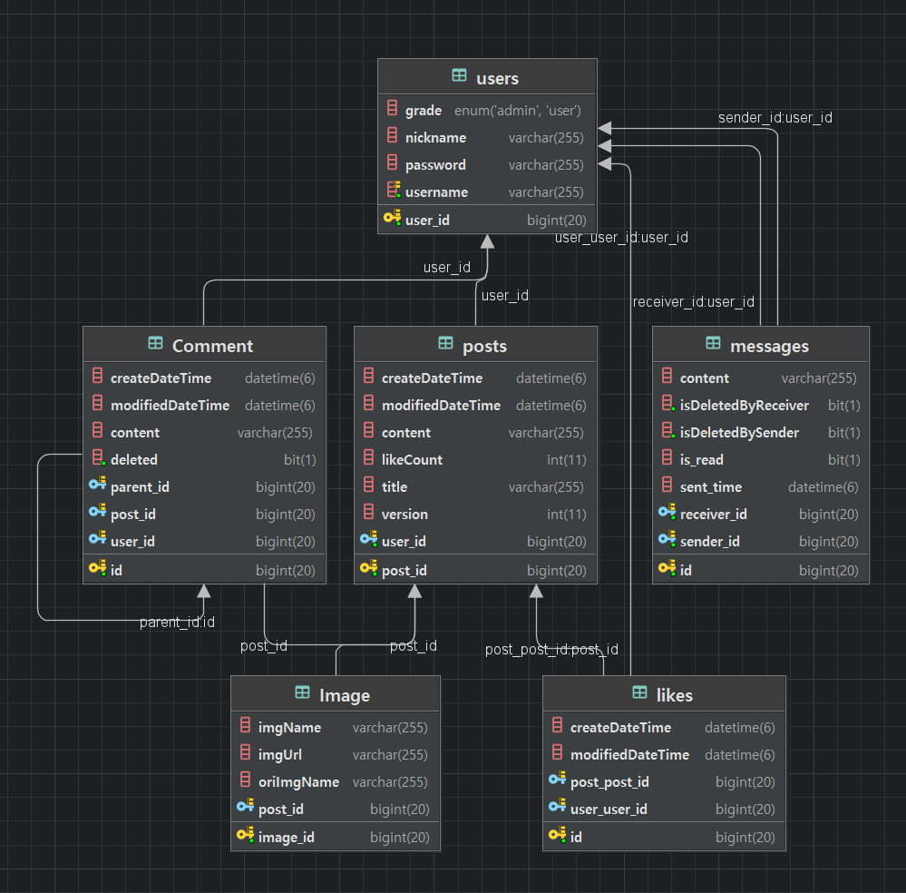

   <h2>👍Board👍</h2>

---

    

---
## 프로젝트 정보
- **유형**: 개인 프로젝트
- **기간**: 2024년 10월 ~ 2024년 12월
- **기술 스택**:
    - **백엔드**: Spring Boot, JPA, QueryDSL
    - **프론트엔드**: Thymeleaf, Bootstrap
    - **데이터베이스**: MariaDB (RDS)
    - **클라우드 서비스**: AWS EC2, S3
    - **버전 관리**: Git, GitHub
---

## 프로젝트 개요
- 주제에 대한 깊은 고민보다는, 직접 만들고 시도해보는 과정 속에서 배움을 얻고자 한 프로젝트입니다.
- 이 프로젝트는 SSR 방식으로 구현하였으며 게시글 작성, 댓글, 대댓글 작성, 검색, 좋아요 기능, 쪽지 등 게시판의 기본적인 기능들을 포함하고 있습니다.
- 또한 프로젝트를 진행하며 SSR와 Rest api의 차이점을 명확히 이해하고 싶어서 비슷한 기능들로 간단한 블로그 api를 만들었었습니다. 이를 통해 클라이언트와 서버 간의 데이터 처리 방식과 설계의 차이를 경험하며 학습할 수 있었습니다.

---
## 화면

    

---
## 프로젝트 DB ERD

    

